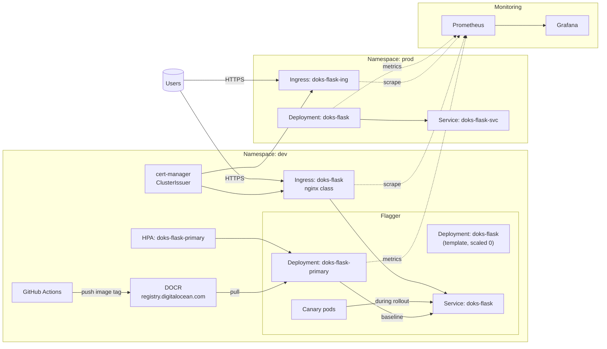

# SaaS on DigitalOcean Kubernetes (DOKS)

[](https://opensource.org/licenses/MIT)
[](https://kubernetes.io/)
[](https://www.digitalocean.com/)
[](https://www.python.org/)

> **End-to-end reference implementation for a multi-environment (dev/prod) web application on DigitalOcean Kubernetes**

This repository demonstrates a production-ready SaaS application deployment using modern cloud-native technologies and best practices. It showcases automated CI/CD pipelines, canary deployments, auto-scaling, monitoring, and secure secret management.

## 🚀 Features

- **🔄 Multi-Environment**: Separate dev and production environments
- **📦 Container Registry**: DigitalOcean Container Registry (DOCR) integration  
- **🚢 CI/CD Pipeline**: GitHub Actions with automated build and deployment
- **🔒 HTTPS/TLS**: Automatic SSL certificates via Let's Encrypt
- **📊 Canary Deployments**: Progressive rollouts with Flagger
- **📈 Auto-scaling**: Horizontal Pod Autoscaler (HPA) with CPU-based scaling
- **🔐 Secret Management**: Sealed Secrets / External Secrets support
- **📈 Monitoring**: Prometheus + Grafana with custom dashboards
- **🌐 Load Balancing**: NGINX Ingress Controller

## 🏗️ Architecture



## 📁 Repository Structure

```
.
├── app/                          # Flask demo application
├── k8s/                          # Kubernetes manifests
│   ├── issuer-cluster.yaml       # cert-manager ClusterIssuers
│   ├── dev/                      # Development environment
│   │   ├── deploy.yaml           # Deployment/Service/HPA
│   │   ├── ingress.yaml          # HTTP Ingress
│   │   └── ingress-tls.yaml      # HTTPS Ingress with TLS
│   └── prod/                     # Production environment
│       ├── deploy.yaml           # Deployment/Service/HPA
│       ├── ingress.yaml          # HTTP Ingress
│       └── ingress-tls.yaml      # HTTPS Ingress with TLS
├── .github/
│   └── workflows/
│       └── cicd-doks.yml         # CI/CD pipeline
├── dashboards/                   # Grafana dashboards
│   ├── grafana-doks-hpa-cpu.json
│   ├── grafana-nginx-canary.json
│   └── grafana-deployment-journey.json
└── README.md
```

## 📋 Prerequisites

Before you begin, ensure you have:

- **DigitalOcean Account** with API token
- **DOKS Cluster** (Kubernetes v1.29+)
- **DOCR Registry** created and linked to your cluster
- **Required Tools**:
  - `kubectl` (Kubernetes CLI)
  - `helm` (Kubernetes package manager) 
  - `doctl` (DigitalOcean CLI)

### GitHub Repository Secrets

Configure the following secrets in your GitHub repository:

| Secret | Description |
|--------|-------------|
| `DO_TOKEN` | DigitalOcean API token |
| `DOCR_REGISTRY` | Container registry name (e.g., `dokr-saas`) |
| `DO_CLUSTER` | DOKS cluster name |
| `GRAFANA_URL` | *(Optional)* Grafana URL for annotations |
| `GRAFANA_API_KEY` | *(Optional)* Grafana API key for annotations |

## 🚀 Quick Start

### 1. Authentication & Setup

```bash
# Login to DigitalOcean Container Registry
doctl registry login

# Create DOCR pull secrets for both environments
doctl registry kubernetes-manifest --namespace dev --registry-name $DOCR_REGISTRY | kubectl apply -f -
doctl registry kubernetes-manifest --namespace prod --registry-name $DOCR_REGISTRY | kubectl apply -f -
```

### 2. Install Required Dependencies

```bash
# Install metrics-server (required for HPA)
helm repo add metrics-server https://kubernetes-sigs.github.io/metrics-server/
helm upgrade --install metrics-server metrics-server/metrics-server -n kube-system \
  --set args={"--kubelet-insecure-tls","--kubelet-preferred-address-types=InternalIP,Hostname,ExternalIP"}

# Install NGINX Ingress Controller with metrics
helm repo add ingress-nginx https://kubernetes.github.io/ingress-nginx
helm upgrade --install ingress-nginx ingress-nginx/ingress-nginx \
  -n ingress-nginx --create-namespace \
  -f ops/ingress-nginx-metrics.values.yaml

# Install cert-manager for automatic TLS certificates
helm repo add jetstack https://charts.jetstack.io
kubectl apply -f https://github.com/cert-manager/cert-manager/releases/latest/download/cert-manager.crds.yaml
helm upgrade --install cert-manager jetstack/cert-manager \
  -n cert-manager --create-namespace --set installCRDs=false

# Install Prometheus and Grafana for monitoring
helm repo add prometheus-community https://prometheus-community.github.io/helm-charts
helm upgrade --install kps prometheus-community/kube-prometheus-stack \
  -n monitoring --create-namespace \
  --set grafana.enabled=true \
  --set grafana.persistence.enabled=false \
  --set alertmanager.enabled=false \
  --set prometheus.prometheusSpec.storageSpec={}
```

### 3. Configure TLS and Ingress

```bash
# Apply TLS certificate issuers
kubectl apply -f k8s/issuer-cluster.yaml

# Get Load Balancer IP and configure hostnames
ING_IP=$(kubectl -n ingress-nginx get svc ingress-nginx-controller -o jsonpath='{.status.loadBalancer.ingress[0].ip}')
export DEV_HOST=dev.${ING_IP}.sslip.io
export PROD_HOST=app.${ING_IP}.sslip.io

# Apply TLS-enabled ingresses
envsubst < k8s/dev/ingress-tls.yaml  | kubectl apply -f -
envsubst < k8s/prod/ingress-tls.yaml | kubectl apply -f -
```

### 4. Deploy Application

```bash
# Deploy to both environments
kubectl apply -f k8s/dev/deploy.yaml
kubectl apply -f k8s/prod/deploy.yaml
```

### 5. Enable Canary Deployments (Development)

```bash
# Install Flagger for progressive deployments
helm repo add flagger https://flagger.app
helm upgrade --install flagger flagger/flagger \
  -n dev --set metricsServer=http://kube-prometheus-stack-prometheus.monitoring:9090

# Configure canary deployment
kubectl apply -f k8s/dev/canary.yaml
```

## 🔄 CI/CD Pipeline

The GitHub Actions pipeline provides automated:

1. **Build & Push**: Builds Docker image and pushes to DOCR
2. **Deploy to Dev**: Automatic deployment to development environment
3. **Manual Promotion**: Manual approval required for production deployment

### Pipeline Stages

```
┌─────────────┐    ┌──────────────┐    ┌─────────────────┐
│ Build & Push│ -> │ Deploy to Dev│ -> │ Promote to Prod │
│   (Auto)    │    │   (Auto)     │    │   (Manual)      │
└─────────────┘    └──────────────┘    └─────────────────┘
```

## 📊 Monitoring & Dashboards

Access Grafana dashboards by port-forwarding:

```bash
kubectl -n monitoring port-forward svc/kps-grafana 3000:80
# Navigate to: http://localhost:3000
# Credentials: admin / prom-operator
```

### Available Dashboards

- **HPA & CPU Metrics**: Monitor auto-scaling behavior
- **NGINX Canary Health**: Track canary deployment progress  
- **Deployment Journey**: Visualize deployment lifecycle

Import dashboard JSON files from the `dashboards/` directory.

## 🧪 Demo & Testing

### 1. Get Application URLs

```bash
ING_IP=$(kubectl -n ingress-nginx get svc ingress-nginx-controller -o jsonpath='{.status.loadBalancer.ingress[0].ip}')
echo "Development: https://dev.${ING_IP}.sslip.io"
echo "Production:  https://app.${ING_IP}.sslip.io"
```

### 2. Trigger Canary Deployment

```bash
# Make a code change and push
sed -i.bak 's/DOKS v[0-9]\+/DOKS vNEXT/' app.py
git add app.py && git commit -m "feat: vNEXT" && git push
```

### 3. Monitor Canary Progress

```bash
kubectl -n dev describe canary/doks-flask | grep -E "Initialized|Advance|Weight|Promoted|Rollback"
```

### 4. Test Auto-scaling

```bash
# Generate load to trigger HPA
kubectl -n dev exec -it $(kubectl -n dev get pod -l app=flagger-loadtester -o jsonpath='{.items[0].metadata.name}') -- \
  hey -z 120s -q 20 http://doks-flask.dev/
```

## 🛠️ Troubleshooting

### Common Issues

**ImagePullBackOff Error**
```bash
# Ensure DOCR secrets exist in namespace
doctl registry kubernetes-manifest --namespace dev --registry-name $DOCR_REGISTRY | kubectl apply -f -
doctl registry kubernetes-manifest --namespace prod --registry-name $DOCR_REGISTRY | kubectl apply -f -
```

**NGINX 502 Error**
- Ensure container port is named `http` in deployment
- Set `service.targetPort: 8080` in Flagger Canary configuration

**Flagger Ingress Issues**
- Create dev Ingress resource first
- Set `spec.ingressRef` on Canary resource

## 💰 Cost Optimization

- Replace dev LoadBalancer Service with Ingress to reduce costs
- Configure appropriate HPA min/max replicas for your workload
- Enable DOCR garbage collection to prune unused image tags
- Consider smaller node sizes for non-production workloads

## 🤝 Contributing

1. Fork the repository
2. Create a feature branch (`git checkout -b feature/amazing-feature`)
3. Commit your changes (`git commit -m 'Add amazing feature'`)
4. Push to the branch (`git push origin feature/amazing-feature`)
5. Open a Pull Request

## 📄 License

This project is licensed under the MIT License - see the [LICENSE](LICENSE) file for details.

## 🙏 Acknowledgments

- [DigitalOcean Kubernetes](https://www.digitalocean.com/products/kubernetes/) for managed Kubernetes
- [Flagger](https://flagger.app/) for progressive delivery
- [cert-manager](https://cert-manager.io/) for automatic TLS certificates
- [Prometheus](https://prometheus.io/) and [Grafana](https://grafana.com/) for monitoring

---

⭐ **Star this repository if you find it helpful!**
